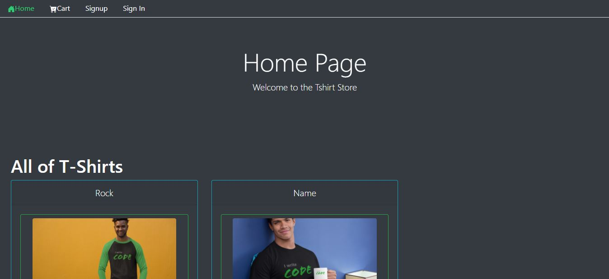
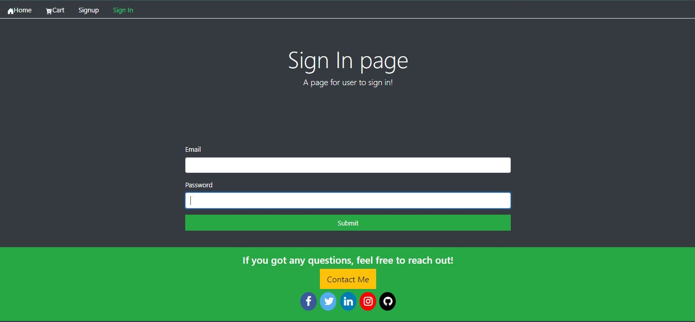
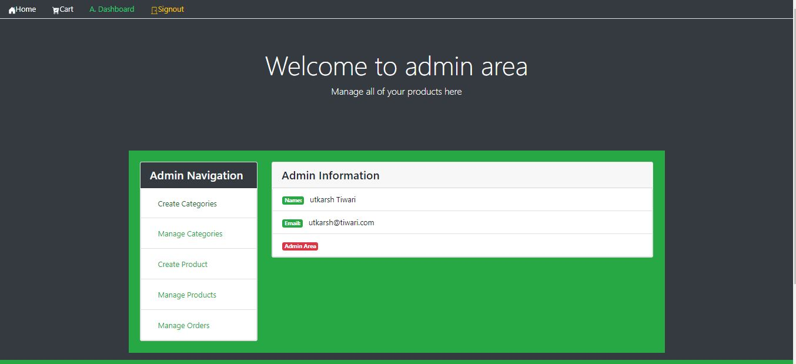
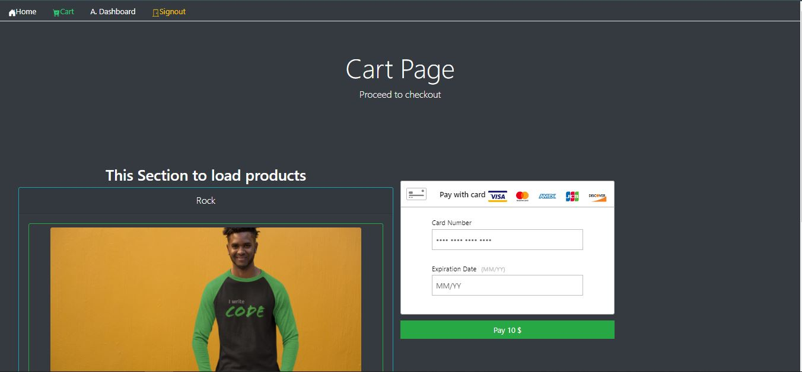

# MERN-e-commer-FE
This project was bootstrapped with [Create React App](https://github.com/facebook/create-react-app).

## Available Scripts

In the project directory, you can run:

### `npm install`

For installing node modules

create a new file (.env) and add the backend url of the app. Name of the variable "REACT_APP_BACKEND"

### Enabling Payment
Create a account in braintree payment  
https://www.braintreepayments.com/sandbox?_ga=1.165187318.898026747.1607234358

### `npm start`

Runs the app in the development mode. 

### `Key features`
1. Login using jwt( JSON WEB TOKEN).  
2. Private routes for accessing dashboard link.  
3. Payment Gateway using braintree payments and stripe.  
4. Functional rendereing of components.  

# SCREENSHOTS

